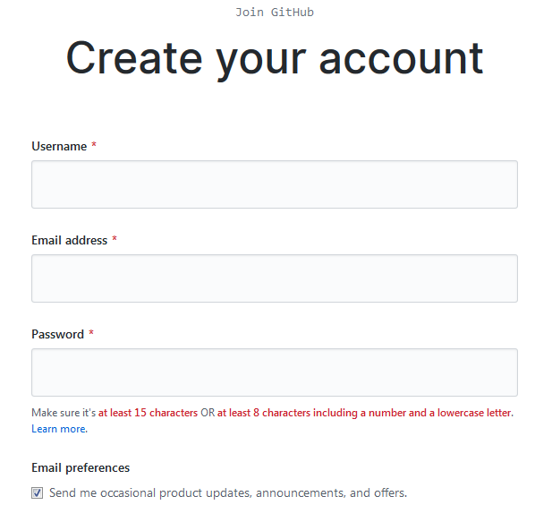
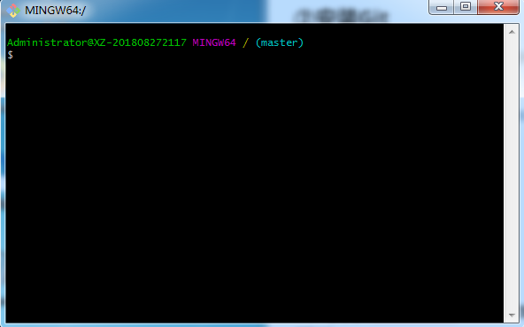
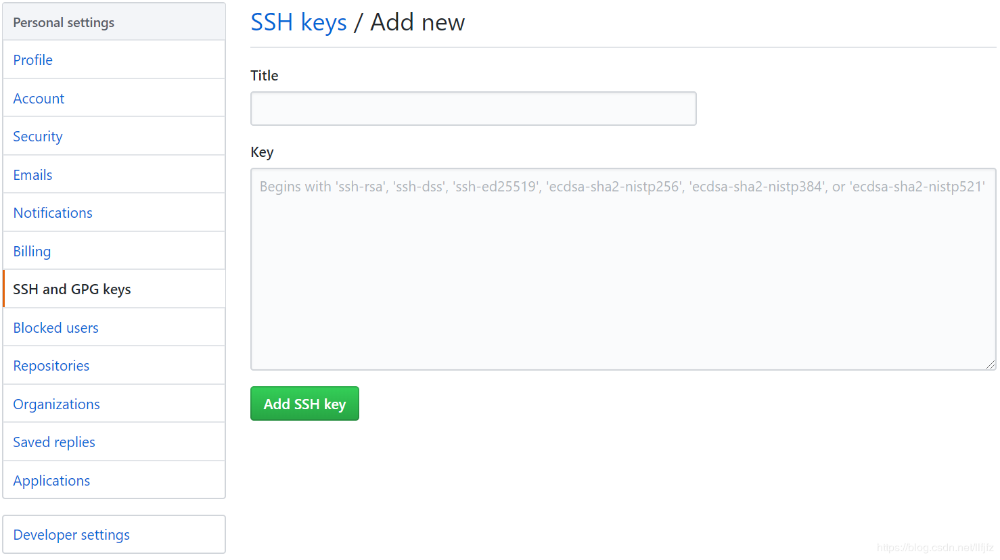
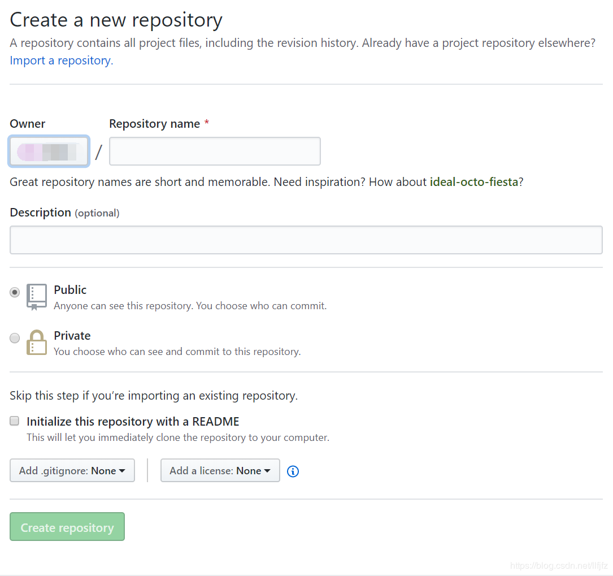
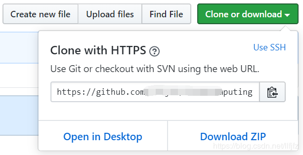

# 云计算实验基础搭建

## 一、购买腾讯云Cent OS服务器

腾讯云服务器有专门的学生套餐，链接：https://cloud.tencent.com/act/campus

地区选择[上海二区]，操作系统选择[CentOS 7.6 64位]，购买时长为6个月


进入腾讯云控制台，选择购买的云服务器，点击登录


输入设置的root密码


登录成功


## 二、创建一个GitHub账号并同步本地项目仓库

### 1、创建账户

进入GitHub官网：https://github.com/，点击右上角的[Sign up]


创建GitHub账户



### 2、安装Git

Git Bash是Windows操作系统下进行Git操作的Shell，简而言之就是同步本地项目到GitHub网站上所使用的命令工具。

下载地址：https://git-scm.com/download/win 或 https://git-for-windows.github.io/    在安装时，全部选择默认即可。

安装成功并打开git-bash.exe ：



### 3、创建SSH Key

使用Git Bash进行命令行操作，首先要拥有一份ssh key进行身份验证。详细信息参见：[Connecting to GitHub with SSH](https://help.github.com/en/articles/connecting-to-github-with-ssh)。

#### ①验证是否存在ssh keys

```
ls -al ~/.ssh
```

默认情况下生成的ssh key放置于“C:\Users\UserName”下的.ssh文件夹中，该命令列出该文件夹下包含的文件。常见的ssh密钥文件可能是以下文件之一：

- id_dsa.pub
- id_ecdsa.pub
- id_ed25519.pub
- id_rsa.pub

#### ②创建新的ssh key

如果不存在ssh密钥，则新建一个：

```
ssh-keygen -t rsa -b 4096 -C “your_email@example.com”
```

your_email@example.com替换成你的Github邮箱地址。随后会让你键入想要保存的ssh key的文件名

```
Enter a file in which to save the key
```

这里建议不输入任何文件名，直接回车，这样就使用系统默认的设置。那么在“C:\Users\UserName”文件夹下就会创建.ssh文件夹，文件夹中生成“id_rsa”和“id_rsa.pub”两个文件，分别对应私钥和公钥。

随后复制“id_rsa.pub”的内容到GitHub网站的Settings–>SSH and GPG keys中：



设置title（任意），并将“id_rsa.pub”的内容复制到“Key”之中。

#### ③测试SSH Key是否配置成功

```
ssh -T git@github.com
```

第一次测试，在continue的时候，选择“yes”，即可显示成功认证。

***特别说明：如果你在上述创建SSH Key文件的时候键入新的文件名，则需要将新文件挂靠到ssh-agent上，否则会出现“git@github.com: Permission denied (publickey)”的错误。***

详细的操作参见：[Generating a new SSH key and adding it to the ssh-agent](https://help.github.com/en/articles/generating-a-new-ssh-key-and-adding-it-to-the-ssh-agent)

### 4、配置GitHub的用户名和邮箱

使用Git Bash配置本地使用Git的全局设置。

[配置用户名](https://help.github.com/en/articles/setting-your-username-in-git)

```
git config --global user.name “your name”
```

"your name"替换成你的GitHub用户名。

[配置邮箱](https://help.github.com/en/articles/setting-your-commit-email-address)

```
git config --global user.email “email@example.com”
```

这里"email@example.com"替换成你的GitHub邮箱。

### 5、访问GitHub网站并新建代码仓库

GitHub可以很方便地创建新的代码仓库“New Repository”：



填写仓库的名称“Repository name”，添加描述“Description”，还可以添加README（此处先不添加，后续采用命令行操作），以及添加忽略文件和开源协议。

### 6、创建本地代码仓库

首先在本地规划好一处文件夹用于同步GitHub的项目，然后打开Git Bash，定位到此次你想要同步的GitHub项目的文件夹，使用“cd”命令。

[接下来将在此文件夹添加刚才创建的GitHub的项目。](https://help.github.com/en/articles/adding-an-existing-project-to-github-using-the-command-line)

#### ①初始化本地文件夹作为一个Git仓库：

```
git init
```

#### ②拷贝GitHub网站中的项目网址：



#### ③添加远程代码仓库的URL：

```
git remote add origin remote_repository_URL
```

`remote_repository_URL`替换为刚才拷贝的项目的URL。说明，origin指代远程代码仓库（GitHub中），master表示本地的主分支。验证一下添加是否成功：

```
git remote -v
```

#### ④首先从远程代码仓库拉取数据：

```
git pull origin master
```

#### ⑤新建README文档，README文档是每个GitHub项目必备，说明项目内容。上文没有创建，在此处完成。

```
touch README.md
```

#### ⑥添加文件夹中的所有文件：

```
git add.
```

#### ⑦提交文件：

```
git commit -m “First commit”
```

注意commit只在本地提交，并未同步到远程服务器。

#### ⑧推送本地更新至远程服务器：

```
git push -u origin master
```

注意：这里第4步，首先从GitHub拉取数据，不要忽略这个步骤。这样容易导致出现本地版本和远程版本冲突的困境。详见错误[Updates were rejected because the tip of your current branch is behind](https://stackoverflow.com/questions/22532943/how-to-resolve-git-error-updates-were-rejected-because-the-tip-of-your-current)。

## 三、安装VMware Workstation虚拟机并下载、创建Cent OS操作系统

