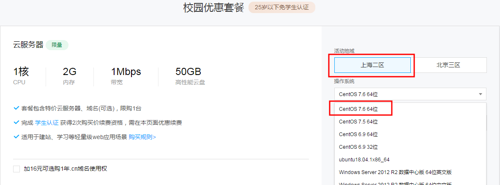
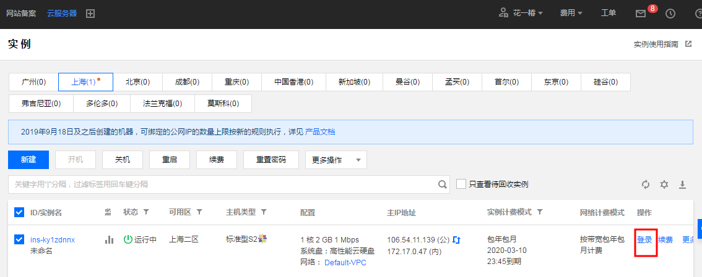
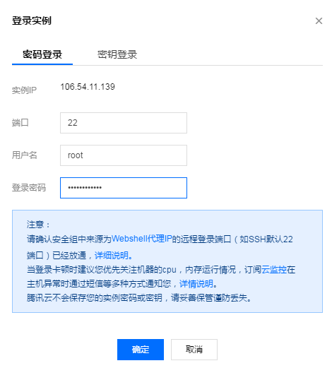
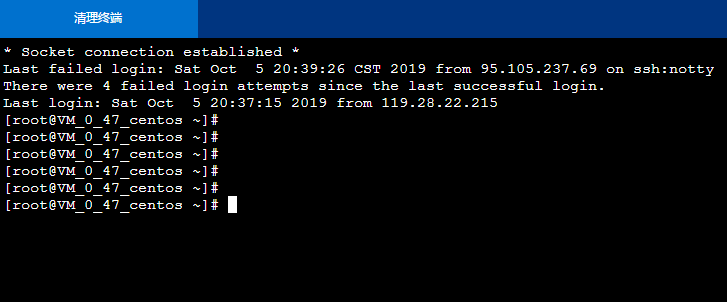

# 云计算实验基础搭建

### 1、购买腾讯云Cent OS服务器

腾讯云服务器有专门的学生套餐，链接：https://cloud.tencent.com/act/campus

地区选择上海二区，操作系统选择CentOS 7.6 64位，购买时长6个月

进入腾讯云控制台，选择购买的云服务器，点击登录

输入设置的root密码，登录成功

### 2、创建一个GitHub账号并创建本地仓库同步

### 3、安装VMware Workstation虚拟机并下载、创建Cent OS操作系统

