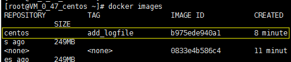

# Docker基础实验

## 步骤一		安装Docker

更新应用程序数据库

```
sudo yum check-update
```

添加Docker的官方仓库，下载最新的Docker并安装：

```
curl -fsSL https://get.docker.com/ | sh
```

启动Docker服务

```
sudo systemctl start docker
```

验证Docker是否成功启动

```
sudo systemctl status docker
```

输出如下：


设置Docker自启动

```
sudo systemctl enable docker
```

查看Docker版本信息：

```
docker version
```


## 步骤二	拉取CentOS镜像，并基于该镜像运行容器，在容器				实例上完成WordPress的安装，并推送到Docker Hub 

查看当前系统docker的相关信息：

```
docker info
```


接下来就要加载Docker镜像了，Docker镜像是容器运行的基础，默认情况下，将从Docker Hub拉取镜像。使用search命令查询Docker Hub中的可用镜像：

```
docker search centos
```

命令从Docker Hub拉取centos镜像的相关信息，并返回可用镜像的列表，输出结果如下：


接下来拉取官方版本(OFFICIAL)的镜像：

```
docker pull centos
```


一旦镜像下载完成，可以基于该镜像运行容器，使用run命令：

```
docker run centos
```

查看一下当前系统中存在的镜像：

```
docker images
```


以上述的CentOS镜像为例运行其容器，使用-it参数进入交互shell模式：

```
docker run -it centos
```

进行container内部shell，如下图所示：


d3e43b333b25代表容器的ID，后续要用到。可以在此shell运行任何命令，比如新建一个logfile文件


现在此容器的bin目录中已经新建了一个logfile文件。***注意：所有对于容器的更改只保存在当前运行的容器中，并未写入镜像。***

接下来将创建新的镜像，即提交更改到新的镜像。首先从容器的交互shell退出并保存状态，使用exit命令

```
exit
```

查看本地中的容器：

```
docker ps -a
```

参数-a表示列出所有容器，包含活跃的和不活跃的。输出如下：


可以发现刚才运行的ID为d3e43b333b25的容器也在列表之中。
现在使用commit命令来提交更改到新的镜像中，即创建新的镜像。命令格式

```
docker commit [OPTIONS] CONTAINER [REPOSITORY[:TAG]]
```

例如：

```
docker commit -m "add logfile" -a "ydy" d3e43b333b25 centos:add_logfile
```

这种提交类似于git协议的提交，同样这里提交的镜像只保存在本地。后续可以提交到远程镜像仓库，比如Docker Hub。
再次使用镜像查看命令：

```
docker images
```

可以看到新生成的镜像:



接下来要为新建的镜像打上标签（Tag），否则后续推送镜像到Docker Hub的时候将出现“ denied: requested access to the resource is denied”的错误。关于这个错误的解答详见[stackoverflow](https://stackoverflow.com/questions/41984399/denied-requested-access-to-the-resource-is-denied-docker)。
Tag命令的语法：

```
docker tag SOURCE_IMAGE[:TAG] TARGET_IMAGE[:TAG]
```

例如：

```
docker tag centos centos:add_logfile
```

进一步细化到推送至Docker Hub的镜像，使用如下格式：

```
docker tag SOURCE_IMAGE[:TAG] docker-hub-username/REPOSITORY[:TAG]
```

其中hub-username是Docker Hub的用户账户，例如：

```
docker tag centos:add_logfile 1521498437/centos:add_logfile
```

完成之后，同样查看已存在的镜像：

```
docker images
```


可以把本地镜像推送到远程镜像仓库，最为著名的就是Docker官方的Docker Hub。当然比如阿里也提供容器仓库，同时也可以自己构建镜像仓库。这里以Docker Hub为例实现镜像推送。首先要到[Docker Hub](https://hub.docker.com/)上进行注册:


然后这里我们使用shell登录：

```
docker login -u docker-hub-username
```

我的docker-hub-username为1521498437

输入密码。用户名和密码都正确，随后会显示登录成功。


使用如下命令推送新创建的镜像：

```
docker push docker-hub-username/docker-image-name
```

本例为：

```
docker push 1521498437/centos:add_logfile
```


完成之后登陆Docker Hub，查看Repository，可以看到新上传的镜像。


### 容器中安装wordpress

运行Docker容器（为了方便检测后续wordpress搭建是否成功，需设置端口映射（-p），将容器端口80 
映射到主机端口8888，Apache和MySQL需要 systemctl 管理服务启动，需要加上参数 –privileged 
来增加权，并且不能使用默认的bash，换成 init，否则会提示 Failed to get D-Bus connection: 
Operation not permitted ，-name 容器名  ，命令如下 ）

```
docker run -d -it --privileged --name wordpress -p 8888:80 -d centos:7 /usr/sbin/init
```

本例添加端口映射如下：


查看容器是否运行：

```
docker ps
```


进入容器前台（容器id可以只写前几位，如 ：75a85）


参照我上一次实验的内容[**实验二website**](https://github.com/1521498437/CloudComputing/tree/master/%E5%AE%9E%E9%AA%8C%E4%BA%8Cwebsite) 来安装httpd、php、mysql和wprdpress（完成之后访问公网IP都需加上端口  :8888)


安装完成后可通过浏览器访问  服务器IP:8888 查看

结果如下所示：


### 容器中安装wordpress至Docker Hub中

将容器生成镜像：

```
docker commit -m "wordpress on centos7" -a "ydy" 75a858a762b1 1521498437/centos
```


打标签：

```
docker tag centos centos:wordpress_on_centos7
docker tag centos:wordpress_on_centos7 1521498437/centos:wordpress_on_centos7
```


查看镜像：

```
docker images
```


登录docker：


推送镜像：

```
docker push 1521498437/centos:wordpress_on_centos7
```


登陆Docker Hub，查看Repository，可以看到镜像已上传：

