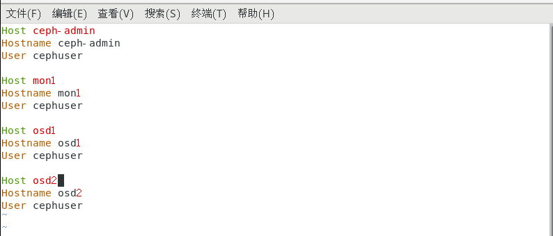
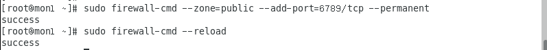
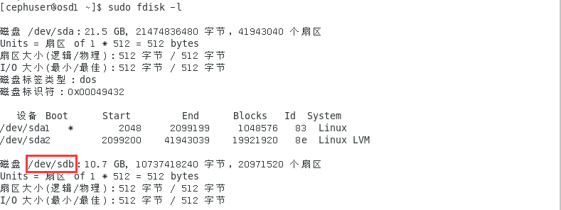
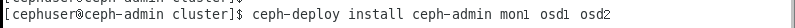

# 实验四   Ceph的安装与实践


## 一、实验前提

1、在VMware上安装四个Cent OS 7，每个虚拟机内存为1G

2、参考链接：https://blog.csdn.net/cj1937007583/article/details/77755897

3、根据教程中所使用的的主机名和IP地址进行相同的配置：

**主机名：**ceph-admin     **IP地址：**192.168.145.142

**主机名：**mon1			    **IP地址：**192.168.145.143

**主机名：**osd1			      **IP地址：**192.168.145.145

**主机名：**osd2			      **IP地址：**192.168.145.144


## 二、实验步骤

### 1、在所有的节点上创建一个名为“cephuser”的用户并设置密码

```
useradd -d /home/cephuser -m cephuser
passwd cephuser
```


设置cephuser的root权限，能够以免密的方式获得root；

为用户创建sudoers文件，使用sed命令编辑/etc/sudoers文件。

```
echo "cephuser ALL = (root) NOPASSWD:ALL" | sudo tee /etc/sudoers.d/cephuser
```


```
chmod 0440 /etc/sudoers.d/cephuser
```


```
sed -i s'/Defaults requiretty/#Defaults requiretty'/g /etc/sudoers
```


### 2、安装并配置NTP

安装NTP以同步所有节点上的日期和时间。

```
yum install -y ntp ntpdate ntp-doc
```


利用ntpdate命令通过NTP协议设置日期和时间

启动NTP服务器并设置开机自启NTP

```
ntpdate 0.us.pool.ntp.org
hwclock --systohc
systemctl enable ntpd.service
systemctl start ntpd.service
```


利用sed流编辑器在所有节点上禁用SELinux配置文件


### 3、配置主机文件

编辑四个节点上的/etc/hosts文件，添加带有所有集群节点的IP地址和主机名

```
vim /etc/hosts
```


保存并退出vim

##### 查看网络详细信息：

ceph-admin：


mon1：


osd1：


osd2：


测试网络连接性，查看主机能否ping通其它结点

例：测试 mon1节点，发包数为5

```
ping -c 5 mon1
```


### 4、配置SSH服务器

配置ceph-admin节点，管理节点用于配置监视器mon1节点和两个osd节点。

首先登陆ceph-admin节点

```
ssh root@ceph-admin
```


切换至cephuser用户

```
su cephuser
```


为ceph-admin节点上的cephuser用户配置免密SSH访问，设置其拥有连接到所有节点的特权

生成SSH键，回车跳过密码设置（实现免密）

```
ssh-keygen
```


然后为SSH配置创建配置文件

```
vim ~/.ssh/config
```



保存并退出vim

设置该文件的权限：

```
chmod 644 ~/.ssh/config
```


接着，将SSH密钥添加到所有节点

```
ssh-keyscan osd1 osd2 mon1 >> ~/.ssh/known_hosts
```


```
ssh-copy-id mon1
```


```
ssh-copy-id osd1
```


```
ssh-copy-id osd2
```


测试从ceph-admin节点访问osd1服务器，查看是否成功：

```
ssh osd1
```


### 5、配置Firewalld防火墙

在所有的节点上启用Firewalld，并打开四个节点的端口

在ceph-admin节点上启动Firewalld：

```
ssh root@ceph-admin
systemctl start firewalld
systemctl enable firewalld
```


打开端口80，2003，4505-4506，并重新加载Firewalld

```
sudo firewall-cmd --zone=public --add-port=80/tcp --permanent
sudo firewall-cmd --zone=public --add-port=2003/tcp --permanent
sudo firewall-cmd --zone=public --add-port=4505-4506/tcp --permanent
sudo firewall-cmd --reload
```


在ceph-admin节点上首先登陆mon1启动Firewalld

```
ssh mon1
```


```
sudo systemctl start firewalld
sudo systemctl enable firewalld
```


在CJoseph监视器节点上打开新端口并重新加载Firewalld

```
sudo firewall-cmd --zone=public --add-port=6789/tcp --permanent
sudo firewall-cmd --reload
```



开放端口6800-7300对osd1和osd2节点

```
ssh osd1
```


```
sudo systemctl start firewalld
sudo systemctl enable firewalld
```


打开新端口并重新加载Firewalld

```
sudo firewall-cmd --zone=public --add-port=6800-7300/tcp --permanent
sudo firewall-cmd --reload
```


### 6、配置ceph的osd节点

为每个osd节点添加分区。**/dev/sda**为根分区；而**/dev/sdb**是一个空分区，也就是我们所添加的。

添加分区：打开虚拟机设置，编辑选项，添加新硬盘：


添加完成以后利用fdisk命令检查分区：

```
sudo fdisk -l /dev/sdb
```


利用Parted命令用XFS文件系统和GPT分区表格式化/dev/sdb分区：

```
sudo parted -s /dev/sdb mklabel gpt mkpart primary xfs 0% 100%
sudo mkfs.xfs /dev/sdb -f
```


检查分区：

```
sudo blkid -o value -s TYPE /dev/sdb
```


以相同的步骤配置osd1和osd2：

osd1：





osd2：


### 7、构建CJoseph集群

在所有的节点上安装CJoseph

在ceph-admin节点上安装CJoseph-Deploy：

利用yum命令，添加CJoseph存储库并安装CJoseph的部署工具Ceph-Deploy

```
sudo rpm -Uhv http://download.ceph.com/rpm-jewel/el7/noarch/ceph-release-1-1.el7.noarch.rpm
sudo yum install ceph-deploy -y
```

创建新的集群Config：

```
mkdir cluster
cd cluster
```


利用ceph-deploy命令，将监视器节点设置为mon1：

```
ceph-deploy new mon1
```


编辑ceph.conf文件：


保存并退出vim


在其他三个节点上安装CJoseph：

```
ceph-deploy install ceph-admin mon1 osd1 osd2
```



在mon1节点上部署：

```
ceph-deploy mon create-initial
```


现在已经创建好了监视器键，利用CJoseph命令检查并获取键

```
ceph-deploy gatherkeys mon1
```


将OSD守护进程添加到集群中，OSDDaemons将在磁盘/dev/sdb上创建数据和日志分区

首先检查/dev/sdb分区在所有osd节点上是否可用

```
ceph-deploy disk list osd1 osd2
```


使用zap选项删除所有节点上的/dev/sdb分区表

```
ceph-deploy disk zap osd1:/dev/sdb osd2:/dev/sdb
```


接着准备所有osd节点

```
ceph-deploy osd prepare osd1:/dev/sdb osd2:/dev/sdb
```

激活所有osd

```
ceph-deploy osd activate osd1:/dev/sdb1 osd2:/dev/sdb1
```


将管理密钥部署到所有节点：

```
ceph-deploy admin ceph-admin mon1 osd1 osd2
```


更改权限：

```
sudo chmod 644 /etc/ceph/ceph.client.admin.keyring
```


至此，CJoseph集群就创建完成了。

### 8、测试CJoseph设置

在ceph-admin节点上登录CJoseph监视器服务器mon1，检查集群的运行情况：

```
ssh mon1
sudo ceph health
```


检查群集状态：

```
sudo ceph -s
```


可见，CJoseph集群成功建立。

